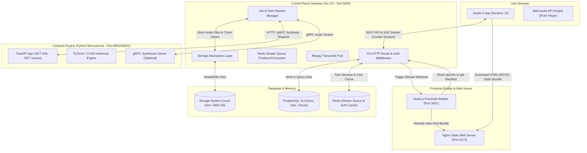
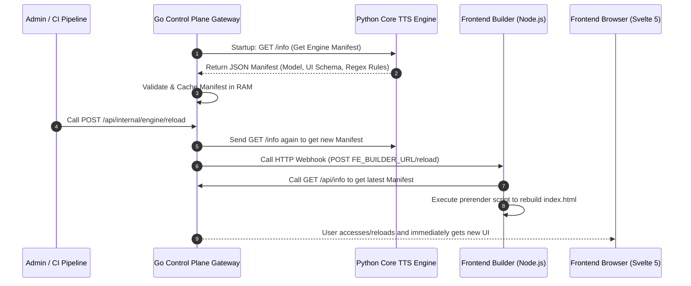
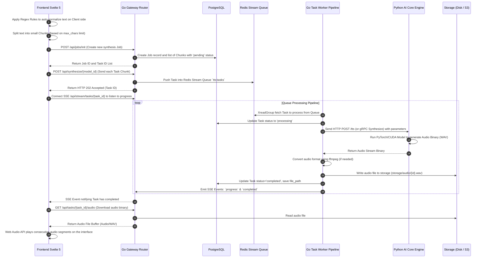
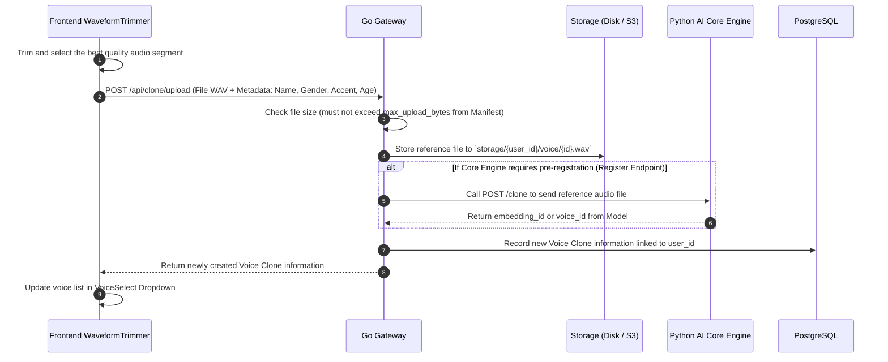

# 🏗️ System Architecture & Data Flow (Deployed Architecture & Data Flow)

This document specifies the overall structure of the **Better TTS UI Studio** system when deployed in a Production environment, how components communicate with each other, the Data Flow, the operation mechanism of Task Workers, and Cron/Sweeper background processes.

---

## 🏛️ 1. Deployed Architecture Diagram

When fully deployed (via Docker Compose or Kubernetes), the system is split into 3 independent layers: **Presentation Layer (Frontend)**, **Control Plane Gateway (Backend Go)**, and **Compute Layer (Python AI Engine)**.



---

## 🔄 2. Detailed Data Flow

### 2.1. Manifest Synchronization Flow (`GET /info` & Webhook Reload)

When the AI Engineer starts or updates the AI model:



---

### 2.2. Text-to-Speech Processing Flow

This is the main flow when the user generates audio from text:



---

### 2.3. Voice Cloning Upload Flow



---

## ⚙️ 3. Task Worker & Concurrency Management

The speech synthesis queue processing system operates in two modes:

1. **Distributed Queue Mode (When Redis is available)**:
   - The Gateway acts as a Producer pushing synthesis requests into **Redis Streams** (Stream key: `tts:tasks`).
   - Worker processes (running within the backend or as separate Worker Pods) act as Consumers using **Redis Consumer Groups**.
   - The number of concurrent jobs in each Worker is limited by the `WORKER_MAX_IN_FLIGHT` environment variable (default: `2`).

2. **In-Memory Queue Fallback Mode (When Redis is unavailable)**:
   - The system automatically switches to using internal Go Channels in RAM.
   - Suitable for local development environments or simple single-replica deployments.

3. **Audio Format Conversion Pool (ffmpeg Transcoder Pool)**:
   - Synthesized audio files from the AI Model, if in a different format than desired, are piped through the `ffmpeg` tool.
   - The transcoding process is limited by the semaphore `TRANSCODE_MAX_CONCURRENCY` (default: `2`) to avoid consuming all server CPU/RAM.

---

## 🕒 4. Background Processes (Cron Jobs & Sweepers)

The system maintains 2 background cleanup processes (Background Sweeper Jobs) that run automatically on a schedule to ensure stability and save storage resources:

```
 ┌────────────────────────────────────────────────────────┐
 │            1. Storage Temp Audio Sweeper               │
 │   - Frequency: Runs once every hour                    │
 │   - Task: Deletes temporary audio files in             │
 │     `storage/temp/` that exceed the retention period    │
 │     `TEMP_AUDIO_RETENTION_HOURS` (Default: 24 hours).   │
 └────────────────────────────────────────────────────────┘

 ┌────────────────────────────────────────────────────────┐
 │            2. Database Stale Task Sweeper              │
 │   - Frequency: Runs once every 5 minutes               │
 │   - Task: Finds Tasks stuck in 'pending' or            │
 │     'processing' status beyond the time period          │
 │     `STALE_CHUNK_AFTER_MINUTES` (Default: 30 minutes).  │
 │   - Action: Marks these orphaned Tasks as               │
 │     'failed' with error 'Task timed out / Worker lost'. │
 └────────────────────────────────────────────────────────┘
```