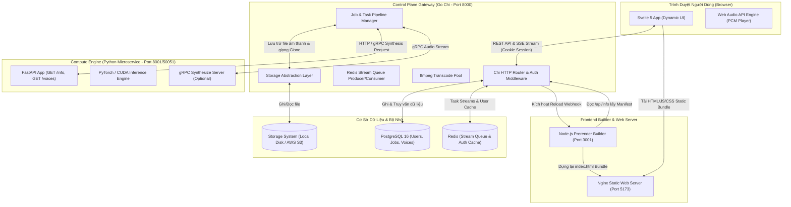
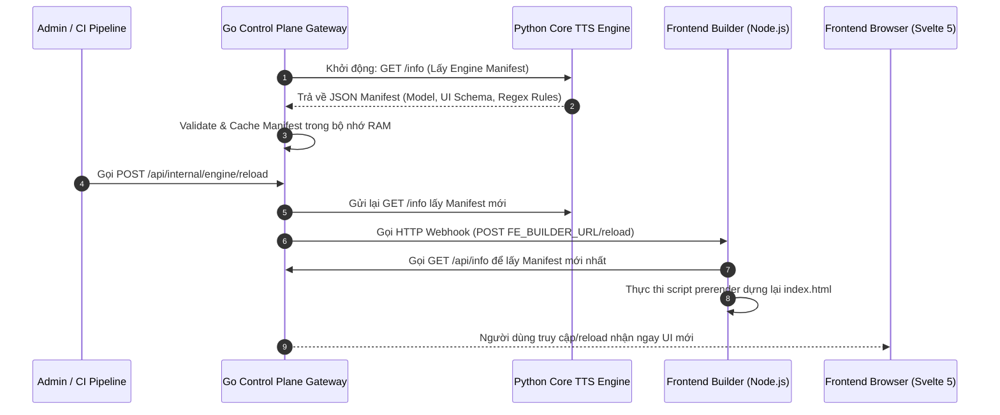
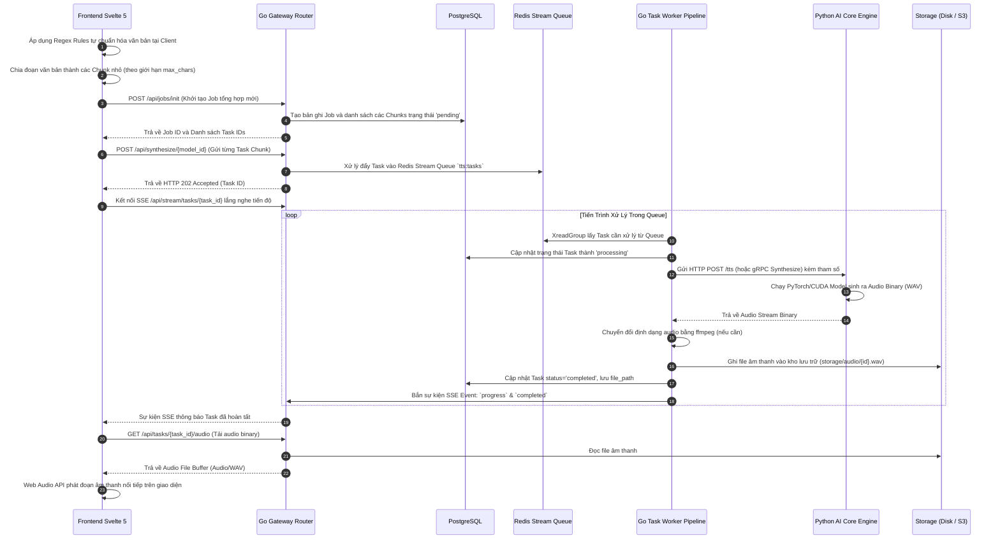
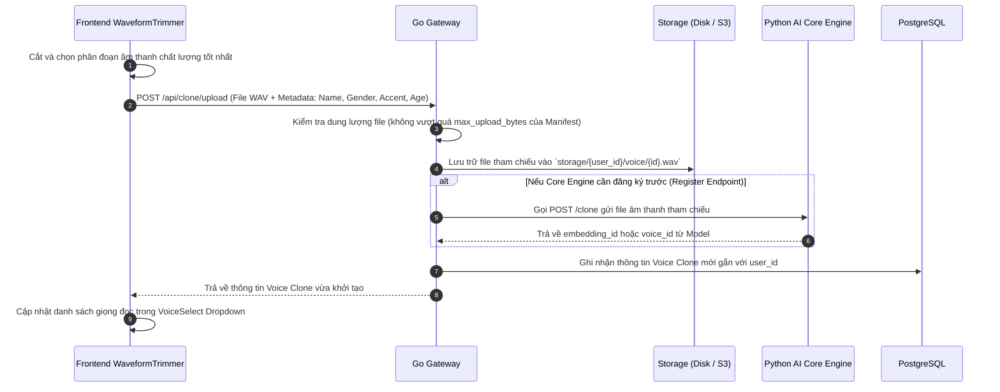

# 🏗️ Kiến Trúc Hệ Thống & Luồng Dữ Liệu (Deployed Architecture & Data Flow)

Tài liệu này đặc tả cấu trúc tổng thể của hệ thống **Better TTS UI Studio** khi triển khai trên môi trường Production, cách các thành phần giao tiếp với nhau, luồng dữ liệu (Data Flow), cơ chế hoạt động của các Task Worker và tiến trình ngầm Cron/Sweeper.

---

## 🏛️ 1. Sơ Đồ Kiến Trúc Hệ Thống Triển Khai (Deployed Architecture)

Khi được triển khai hoàn chỉnh (thông qua Docker Compose hoặc Kubernetes), hệ thống phân tách làm 3 tầng độc lập: **Presentation Layer (Frontend)**, **Control Plane Gateway (Backend Go)** và **Compute Layer (Python AI Engine)**.



---

## 🔄 2. Chi Tiết Luồng Dữ Liệu (Data Flow)

### 2.1. Luồng Đồng Bộ Manifest (`GET /info` & Webhook Reload)

Khi AI Engineer khởi chạy hoặc cập nhật mô hình AI:



---

### 2.2. Luồng Tổng Hợp Tiếng Nói (Text-to-Speech Processing Flow)

Đây là luồng chính khi người dùng tạo âm thanh từ văn bản:



---

### 2.3. Luồng Tải Lên Giọng Mẫu Clone (Voice Cloning Flow)



---

## ⚙️ 3. Quản Lý Tiến Trình Worker (Task Workers & Concurrency)

Hệ thống xử lý hàng đợi tổng hợp tiếng nói thông qua hai chế độ hoạt động:

1. **Chế Độ Distributed Queue (Khi có Redis)**:
   - Gateway đóng vai trò làm Producer đẩy các yêu cầu tổng hợp vào **Redis Streams** (Stream key: `tts:tasks`).
   - Các tiến trình Worker (nằm ngay trong backend hoặc chạy thành các Pod Worker riêng biệt) đóng vai trò Consumer sử dụng **Redis Consumer Groups**.
   - Số lượng công việc chạy đồng thời trong mỗi Worker được khống chế bởi biến môi trường `WORKER_MAX_IN_FLIGHT` (mặc định: `2`).

2. **Chế Độ In-Memory Queue Fallback (Khi không có Redis)**:
   - Hệ thống tự động chuyển sang sử dụng Go Channels nội bộ trong RAM.
   - Thích hợp cho môi trường phát triển cục bộ (Local Development) hoặc triển khai đơn giản 1 replica.

3. **Pool Chuyển Đổi Định Dạng Audio (ffmpeg Transcoder Pool)**:
   - Các file âm thanh tổng hợp đầu ra từ AI Model nếu khác định dạng mong muốn sẽ được đẩy qua công cụ `ffmpeg`.
   - Tiến trình chuyển mã được giới hạn bởi semaphore `TRANSCODE_MAX_CONCURRENCY` (mặc định: `2`) để tránh ngốn toàn bộ CPU/RAM của server.

---

## 🕒 4. Tiến Trình Ngầm (Cron Jobs & Sweepers)

Hệ thống duy trì 2 tiến trình dọn dẹp ngầm (Background Sweeper Jobs) tự động chạy theo chu kỳ để đảm bảo tính ổn định và tiết kiệm tài nguyên lưu trữ:

```
 ┌────────────────────────────────────────────────────────┐
 │            1. Storage Temp Audio Sweeper               │
 │   - Tần suất: Chạy mỗi 1 giờ một lần                   │
 │   - Nhiệm vụ: Xóa các file audio tạm trong           │
 │     `storage/temp/` quá thời hạn                     │
 │     `TEMP_AUDIO_RETENTION_HOURS` (Mặc định: 24 giờ).    │
 └────────────────────────────────────────────────────────┘

 ┌────────────────────────────────────────────────────────┐
 │            2. Database Stale Task Sweeper              │
 │   - Tần suất: Chạy mỗi 5 phút một lần                  │
 │   - Nhiệm vụ: Tim các Task đứng ở trạng thái           │
 │     'pending' hoặc 'processing' quá khoảng thời gian    │
 │     `STALE_CHUNK_AFTER_MINUTES` (Mặc định: 30 phút).    │
 │   - Hành động: Đánh dấu các Task mồ côi này thành      │
 │     'failed' kèm lỗi 'Task timed out / Worker lost'.   │
 └────────────────────────────────────────────────────────┘
```
