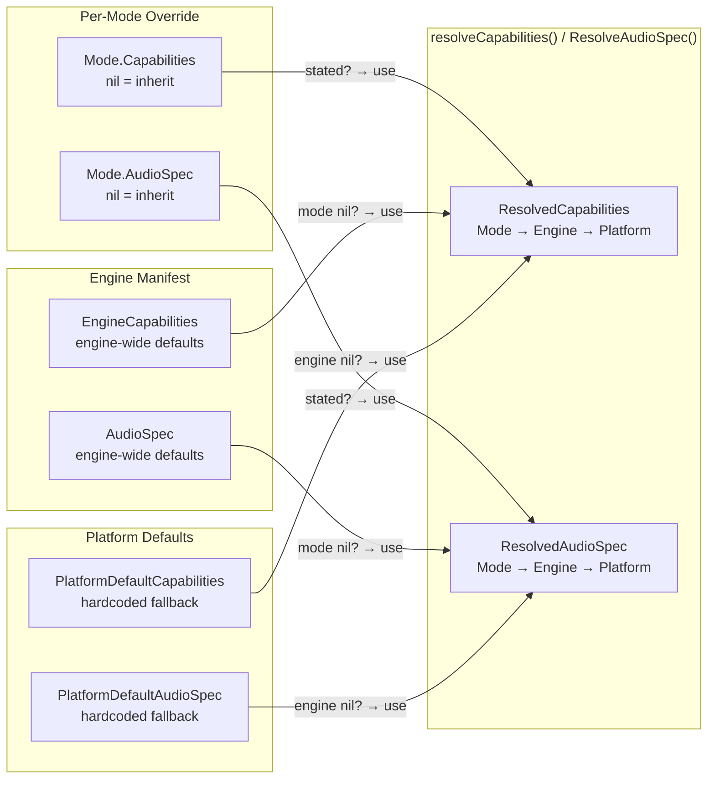
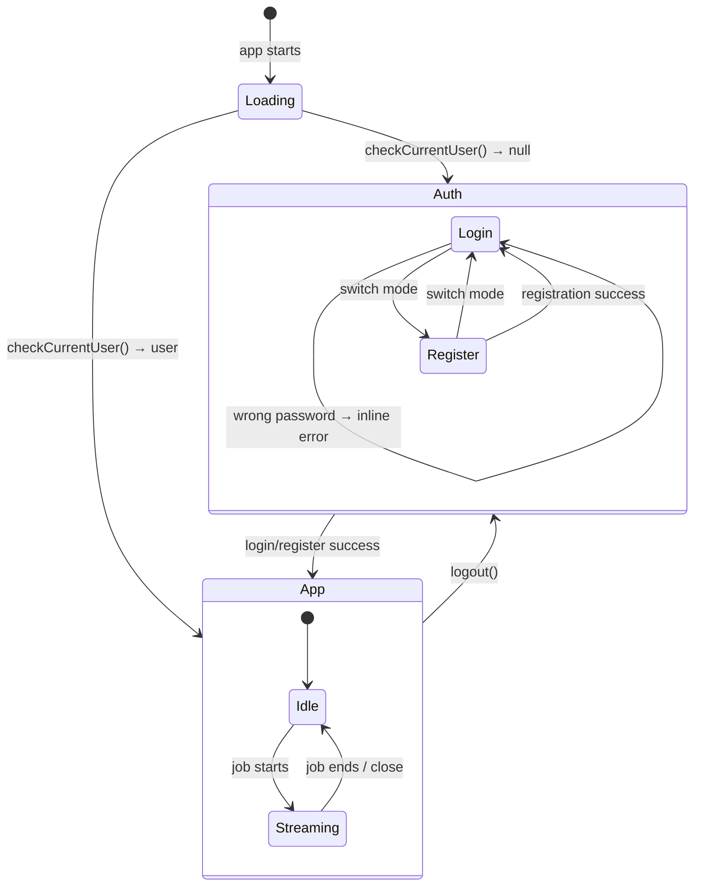
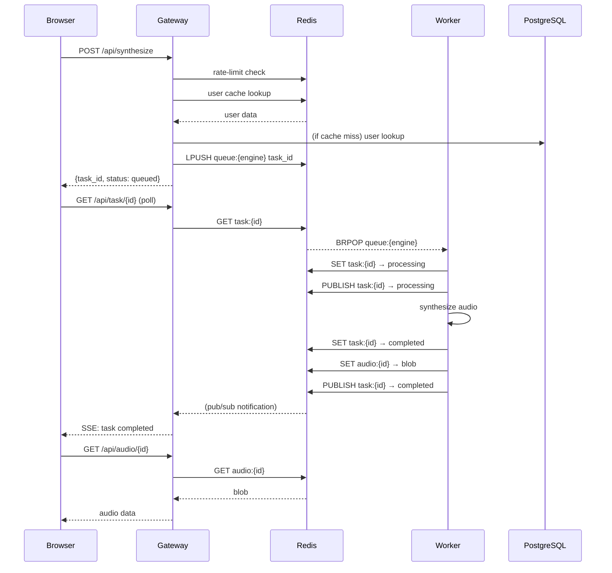
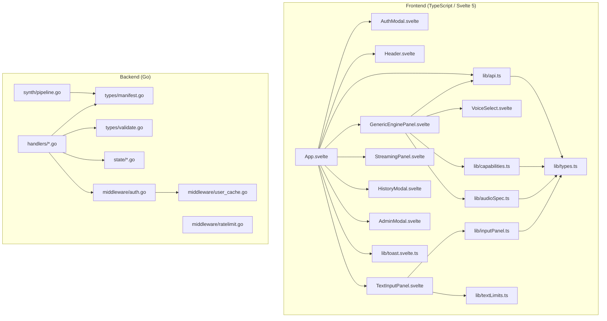
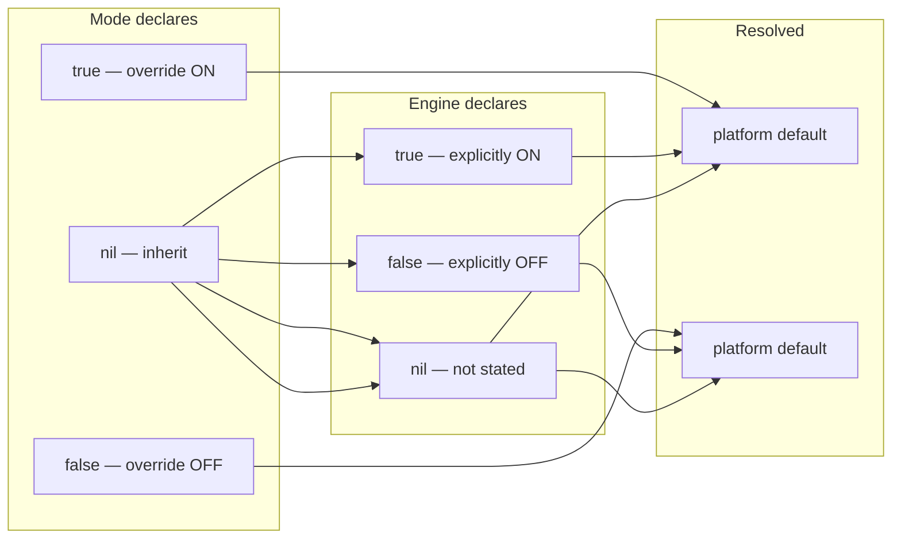
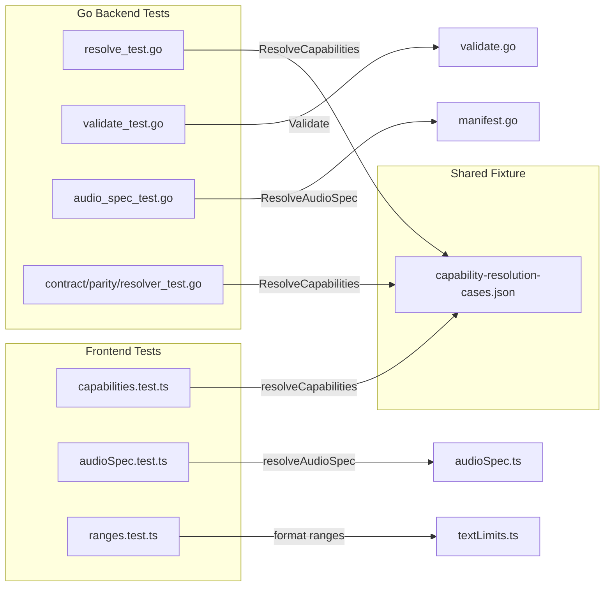

# System Architecture Diagrams

> Mermaid diagrams describing the major flows and structures of the AI Voice Studio platform.

---

## 1. System Architecture

```mermaid
graph TB
    subgraph Browser["Browser (Svelte 5)"]
        UI[App UI]
        SW[Service Worker]
    end

    subgraph Gateway["Go Gateway (API)"]
        AUTH[Auth Middleware]
        RATE[Rate Limiter]
        MANIFEST[Manifest Cache]
        TASK[Task Manager]
        UPLOAD[Upload Handler]
    end

    subgraph Redis["Redis (Shared State)"]
        TASK_STATE[task:{id} — state & progress]
        AUDIO[audio:{id} — output blob]
        QUEUE[queue:{engine} — pending tasks]
        RATELIMIT[ratelimit:{user} — counters]
        USER_CACHE[auth:user:{name} — 5s TTL]
        ONLINE[online:{user} — 60s heartbeat]
        PUBSUB[Pub/Sub — task events]
    end

    subgraph PG["PostgreSQL (Durable Data)"]
        USERS[users + auth]
        HISTORY[synthesis history]
        VOICES[voice metadata]
    end

    subgraph Worker["Engine Worker (Python)"]
        ENGINE[Core AI Engine]
    end

    Browser -->|HTTP/SSE| Gateway
    Gateway -->|read/write| Redis
    Gateway -->|read| PG
    Gateway -->|gRPC| Worker
    Worker -->|write progress| Redis
    Worker -->|write output| Redis
    Worker -->|notify| PUBSUB
    Gateway -->|subscribe| PUBSUB
```

---

## 2. Manifest Resolution Chain



---

## 3. Auth State Machine



---

## 4. Synthesis Request Flow



---

## 5. Cache Architecture

```mermaid
flowchart TD
    subgraph Redis["Redis — cross-process state"]
        TASK[task:{id} — TTL 5min]
        AUDIO[audio:{id} — TTL 5min]
        QUEUE[queue:{engine} — list]
        RATE[ratelimit:{user} — window]
        UCACHE[auth:user:{name} — TTL 5s]
        ONLINE[online:{user} — TTL 60s]
    end

    subgraph RAM["In-Memory — hot singletons"]
        MANIFEST[ManifestCache]
        TASKMGR[TaskManager]
        VOICE_CACHE[PresetVoiceCache]
        CONCURRENCY[Concurrency limiter]
    end

    subgraph DB["PostgreSQL — durable state"]
        USERS[users]
        HISTORY[history]
        VOICES[voices]
    end

    subgraph CLIENT["Browser"]
        FE[Frontend]
    end

    FE -->|reads| MANIFEST
    FE -->|API calls| TASK
    FE -->|API calls| AUDIO

    API[Gateway API] -->|reads/writes| TASK
    API -->|reads/writes| AUDIO
    API -->|reads/writes| QUEUE
    API -->|reads/writes| RATE
    API -->|reads| UCACHE
    API -->|miss →| DB
    API -->|reads| MANIFEST
    API -->|updates| ONLINE

    WORKER[Worker] -->|reads/writes| TASK
    WORKER -->|writes| AUDIO
    WORKER -->|reads| QUEUE
```

---

## 6. File & Module Dependencies



---

## 7. Three-State Boolean Pattern



---

## 8. Test Coverage Map



---

## Legend

| Symbol | Meaning |
|--------|---------|
| `→` | Data flow / dependency |
| `-->>` | Async / poll / subscribe |
| `nil` | Not stated, inherit from parent |
| Platform Default | Hardcoded fallback when nothing else declares a value |