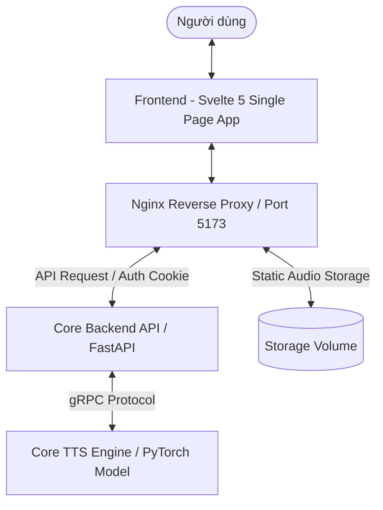

# Tổng Quan Về Frontend (Better TTS UI Studio)

## 1. Giới Thiệu Chung
**Better TTS UI Studio Frontend** là giao diện người dùng (Web Application) hiện đại dành cho hệ thống tổng hợp giọng nói trí tuệ nhân tạo Better TTS Studio. 

Ứng dụng được thiết kế nhằm cung cấp trải nghiệm làm việc chuyên nghiệp, trực quan và mượt mà cho việc chuyển đổi văn bản thành giọng nói (Text-to-Speech), sao chép giọng nói (Voice Cloning), xử lý file âm thanh trực tiếp và quản lý lịch sử tổng hợp.

---

## 2. Điểm Nổi Bật Về Giao Diện & Trải Nghiệm (UI/UX)

- **Phong cách Modern Dark Studio**: Giao diện tông màu tối sang trọng, áp dụng hiệu ứng kính nhám (Glassmorphism), màu sắc HSL hài hòa giúp giảm mỏi mắt khi làm việc thời gian dài.
- **Tối ưu Đa Nền Tảng (Responsive & Touch-Friendly)**: Tự động tương thích từ màn hình Desktop độ phân giải cao đến thiết bị di động (Mobile/Tablet), hỗ trợ cuộn ngang danh mục và thao tác cảm ứng tối ưu.
- **Micro-Animations & Visual Feedback**: Phản hồi trực quan tức thì thông qua hệ thống Toast notifications, thanh trạng thái tiến trình (progress bar), badge phân loại màu sắc và hiển thị dạng sóng âm (waveform).

---

## 3. Các Tính Năng Cốt Lõi

### 3.1. Bộ Công Cụ Nhập & Xử Lý Văn Bản (Text Input Panel)
- Cho phép nhập văn bản dung lượng lớn, tự động đếm số từ, số ký tự và ước tính thời lượng phát âm.
- Tích hợp bộ tìm kiếm & thay thế hàng loạt (Search & Replace) thông minh với khả năng phân biệt hoa/thường hoặc khớp chính xác từ.
- Phân đoạn văn bản (Text Chunking) tự động để tối ưu hóa quá trình tổng hợp theo thời gian thực.

### 3.2. Chuyển Đổi Engine & Chọn Giọng Nói (Engine & Voice Selector)
- Đổi linh hoạt giữa các TTS Engine: **Standard Engine**, **Voice Cloning Engine**, và **Fast Engine**.
- Cho phép tìm kiếm, lọc theo giới tính/vùng miền và nghe thử (preview) các mẫu giọng nói sẵn có.

### 3.3. Phát Trực Tiếp & Cắt Ghép Âm Thanh (Streaming & Audio Trimmer)
- **Real-time Streaming**: Nghe trước âm thanh ngay khi từng đoạn (chunk) vừa được tổng hợp xong mà không cần chờ toàn bộ file.
- **Waveform Trimmer**: Trình chỉnh sửa sóng âm dạng đồ họa ngay trên trình duyệt, cho phép xem dạng sóng (WAV pattern), cắt cúp khoảng lặng, chọn vùng âm thanh mong muốn và xuất file.

### 3.4. Sao Chép Giọng Nói (Voice Cloning)
- Cho phép người dùng ghi âm hoặc tải lên (upload) mẫu giọng nói cá nhân.
- Tự động phân tích, trích xuất đặc trưng giọng nói và tạo hồ sơ giọng mới (Voice Profile).

### 3.5. Quản Lý Lịch Sử & Tệp Âm Thanh (History Dashboard)
- Lưu trữ danh sách các tác vụ TTS đã thực hiện.
- Hỗ trợ lọc theo loại Engine, trạng thái, tìm kiếm theo nội dung văn bản và tải xuống các định dạng audio (WAV, MP3).

### 3.6. Xác Thực & Giao Diện Quản Trị (Auth & Admin Studio)
- Cơ chế đăng nhập an toàn lưu trữ phiên làm việc qua HttpOnly Cookie.
- Modal quản trị dành cho Administrator để quản lý người dùng, phân quyền và cấu hình hệ thống.

---

## 4. Sơ Đồ Luồng Dữ Liệu Tổng Thể

